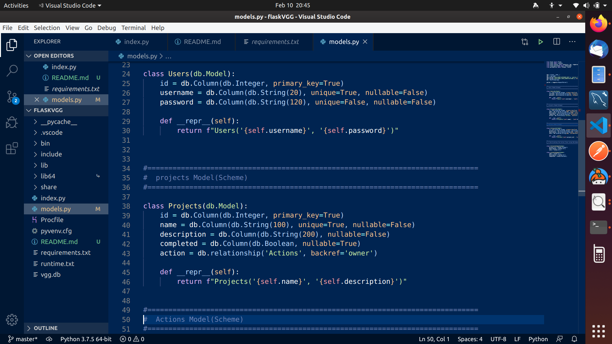
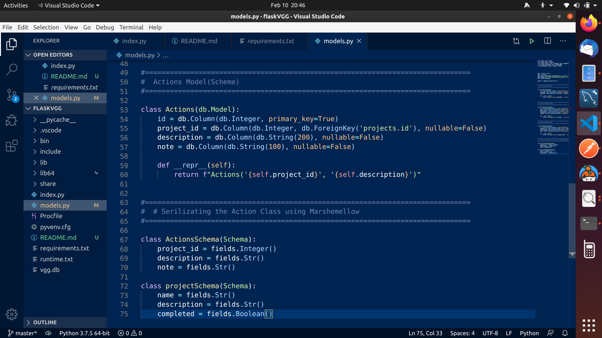
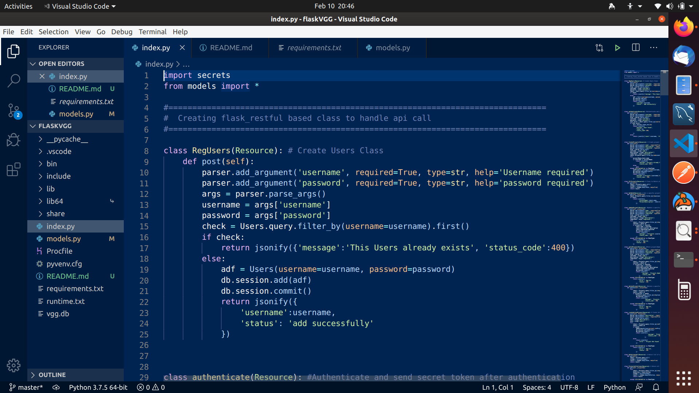
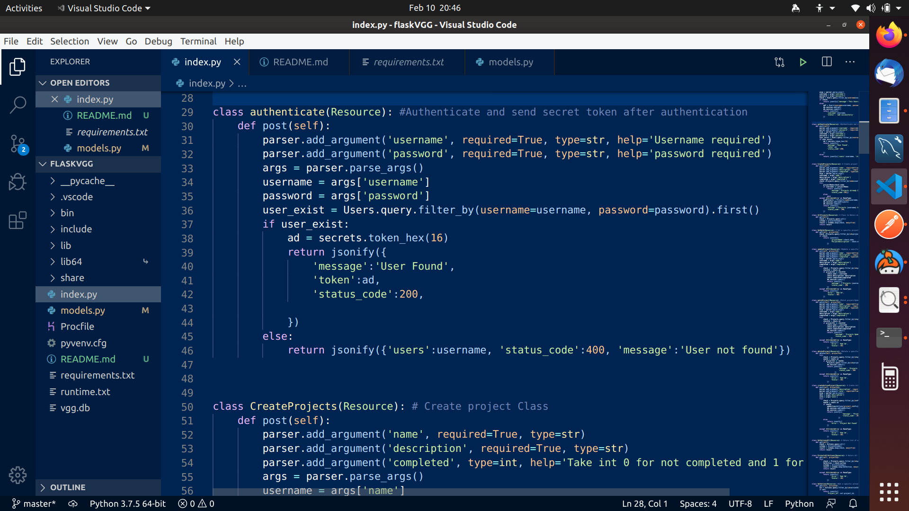
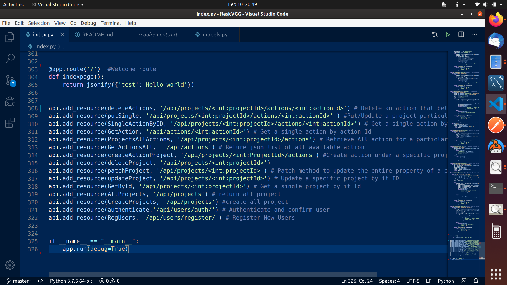

# FLASK API CHALLENGE VGG

---

## This is an api created using flask_restful with python to manage Projects and Actions feel free to test it out on [HEROKU](https://h0rgukoya2.execute-api.us-east-1.amazonaws.com/dev)
> Challenge Description:
> In this challenge, you design and create a web API to manage the following
> resources: Projects and Actions.

---

# FEATURES
* A model for Users, Projects, and Actions
* Create Users using a POST request
* Create a Project Using a POST Request
* Create Actions using a POST Request
* Authenticate users and generate token
* Get all Projects Using a GET Request
* Get a project by id
* Update an existing project using a PUT Request
* Update property of a particular project using PATCH
* Delete a project using DELETE
* Create actions using POST
* Get list of all Actions using GET
* Get a single action by it ID
* Delete an action that belong to a project using action ID

---
# STATUS CODE AND MEANING
* 400 - Bad Request User/Project already exist
* 200 - Successful
* 402 - Bad id request

# REQUIREMENT
* aniso8601==8.0.0
* Click==7.0
* Flask==1.1.1
* Flask-RESTful==0.3.8
* Flask-SQLAlchemy==2.4.1
* gunicorn==20.0.4
* itsdangerous==1.1.0
* Jinja2==2.11.1
* MarkupSafe==1.1.1
* marshmallow==3.4.0
* pytz==2019.3
* six==1.14.0
* SQLAlchemy==1.3.13
* Werkzeug==1.0.0

# SCREENSHOTS

# TESTING THE APP
- clone the repo
- create a virtual environment
- activate your virtual environment
- pip install -r requirements.txt
- python index.py

# CONCLUSION
## Dont forget to test it out on [HEROKU](https://apichalleng.herokuapp.com/)
